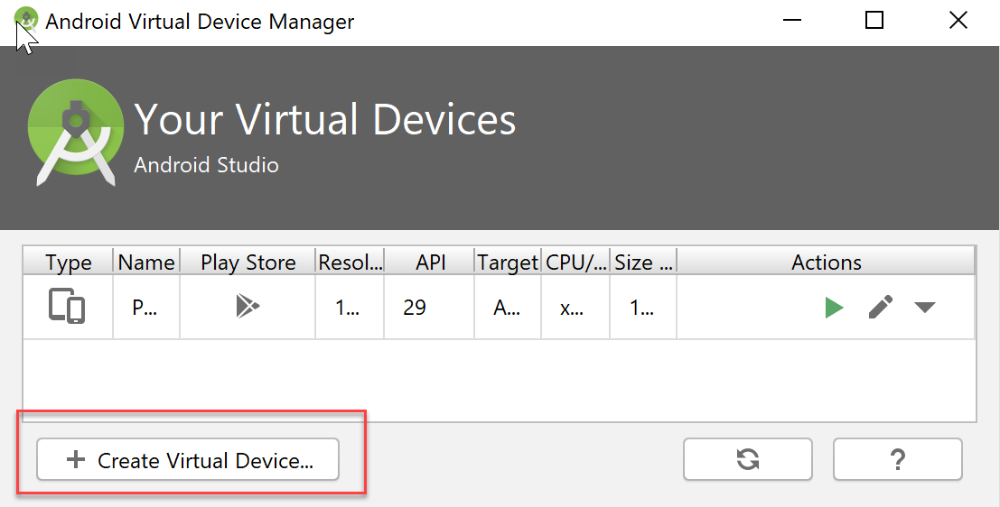

# Ionic Application

The Ionic application was build with the
[Ionic framework](https://ionicframework.com/), an open-source front-end
development kit for building cross-platform mobile apps with HTML5 and Javascript.

## Getting started

First, install [Node.js](https://nodejs.org/en/).  The cognitive services plugin supports Node version 10.9 or greater.

Next, install Ionic using the following command:

```bash
npm install -g ionic
```

Note:  Visual Studio Code was used for development and ionic was installed
through VS Code.

## Dependencies

### Create a Speech resource in Azure

To add a Speech Services resource to your Azure account:

1. Sign in to the [Azure portal](https://portal.azure.com/) using your Microsoft
account.

1. Select **Create a resource** at the top left of the portal.

    

1. In the **New** window, search for **speech**.

1. In the search results, select **Speech**.

    

1. Under **Speech**, select the **Create** button.

    

1. Under **Create**, enter:

   * A name for the new resource. The name helps you distinguish among multiple
   subscriptions to the same service.
   * Choose the Azure subscription that the new resource is associated with to
   determine how the fees are billed.
   * Choose the region where the resource will be used.
   * Choose either a free or paid pricing tier.
   * Create a new resource group for this Speech subscription or assign the
   subscription to an existing resource group. Resource groups help you keep your
   various Azure subscriptions organized.
     * Select **Create.**

     

     It takes a moment to create and deploy your new Speech resource. Select
     **Quickstart** to see information about your new resource.

     

1. Under **Quickstart**, select the **Keys** link under step 1 to display your
subscription keys. Each subscription has two keys; you can use either key in your
application. Select the button next to each key to copy it to the clipboard for
pasting into the [Environment.ts](\src\environments\environment.ts) file.
1. Copy the name of the Speech Service and the region of the service into the
Environments.ts file.

## Install packages using NPM

In the folder of the Ionic Application (ie examples/ionic-angular), run the following steps.

Run the following command to install all packages within the app.  In a terminal
window, browse to the examples/ionic-angular folder
and run the following:

```bash
npm install
```

Install Native-Run so that the application can run the cordova native platforms (android, ios, or browser)

```bash
npm i -g native-run
```

Install Cordova

```bash
npm i -g cordova
```

To include the wrapper for the Cognitive Services plugin as an observable, run the following command:

```bash
cp -r ../../cognitiveservices node_modules/@ionic-native/
```

While this should install all components, there have been a few changes to
cordova recently and errors were being generated while devloping on the Mac.  
If you get errors, specifically using toLowerCase, the run the following commands:

```bash
npm uninstall cordova
npm install cordova@latest
cordova platform remove ios
cordova platform add ios
```

## Run the Application

### Run on Browser

To run the application, in a terminal window, browse to the examples/ionic-angular folder
and run the following:

```bash
ionic cordova run browser
```

### Run in Android Emulator

#### Setting up Android environment

These steps are to set up your SDK environment to build, test, and deploy
Android apps.

1. Install [Java Development Kit (JDK) 8](http://www.oracle.com/technetwork/java/javase/downloads/jdk8-downloads-2133151.html)
 or later.
1. Install [Gradle](https://gradle.org/).  Go through each steps on the
[Gradle Installation](https://gradle.org/install/) page.
1. Install [Android Studio](https://developer.android.com/studio/index.html).
1. After installing Android Studio, run the Android Studio Setup Wizard to
download some standard components that are required for development.

#### Creating an emulator

1. In Android Studio, click the AVD Manager in the Toolbar.

    

1. In the Select Deployment Target window, click Create New Virtual Device.

    

1. Select a device configuration of your choice and press Next.

    

1. Download and select a system image.  Press next.

    

1. Verify configuration and press finish.

    

1. In the Virtual Device Manager, select the run button to start the emulator.

    

#### Run Android Application

To run the application, in a terminal window, browse to the speecthtoText folder
and run the following:

```bash
ionic cordova run android
```

### Run in iOS Emulator

#### Setting up iOS environment

These steps are to set up your SDK environment to build, test, and deploy
iOS apps.  This will only work on a Mac.

1. Install [XCode](https://developer.apple.com/download/) with Apple Developer
account, or download from the App Store.

#### Run iOS Application

To run the application, in a terminal window, browse to the speecthtoText folder
and run the following:

```bash
ionic cordova run ios
```

By participating in this project, you
agree to abide by the [Microsoft Open Source Code of Conduct](https://opensource.microsoft.com/codeofconduct/)
